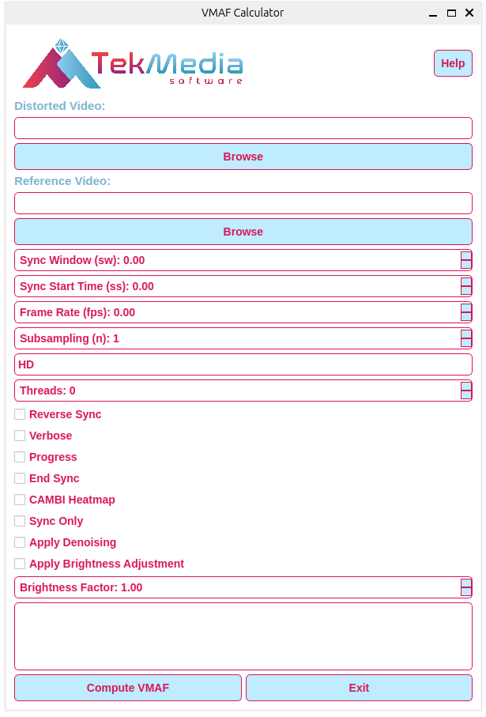
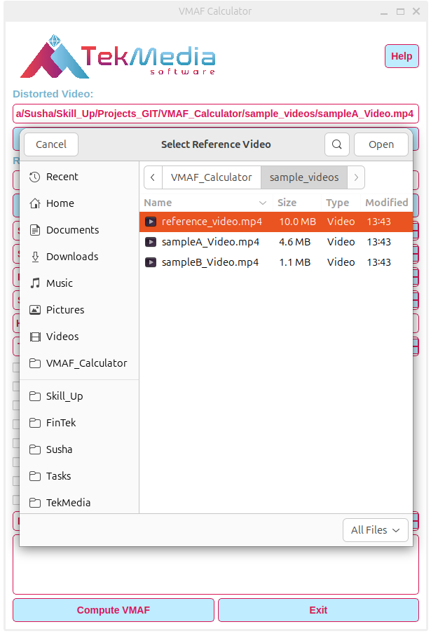
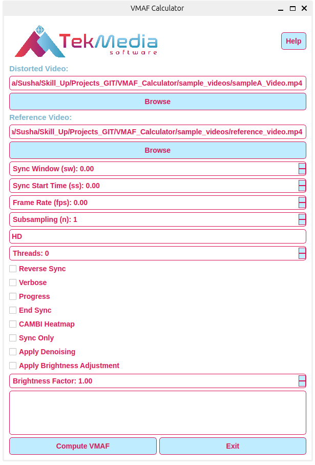
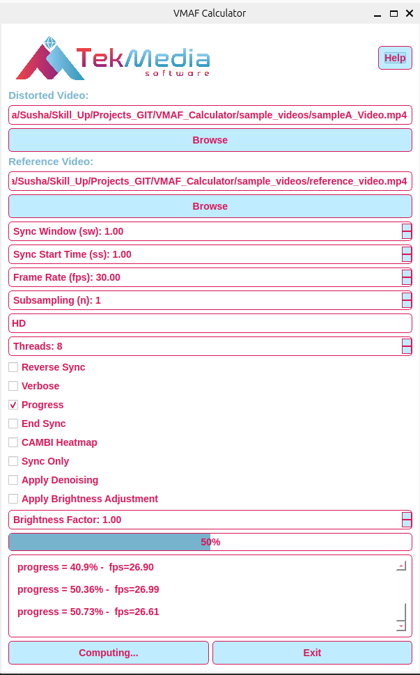
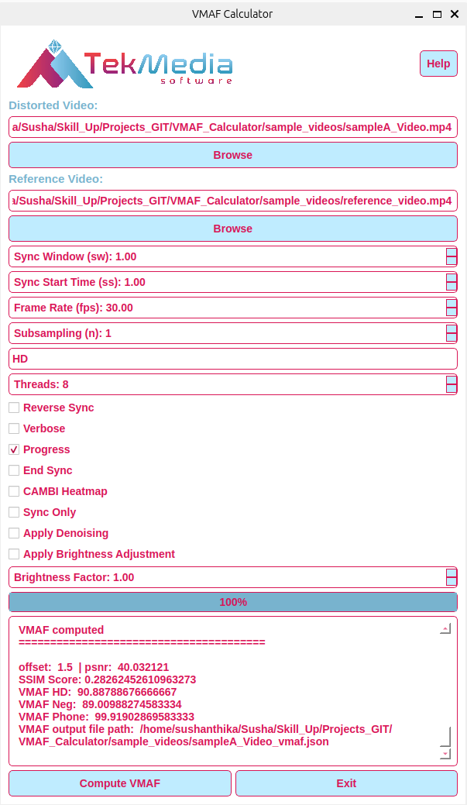
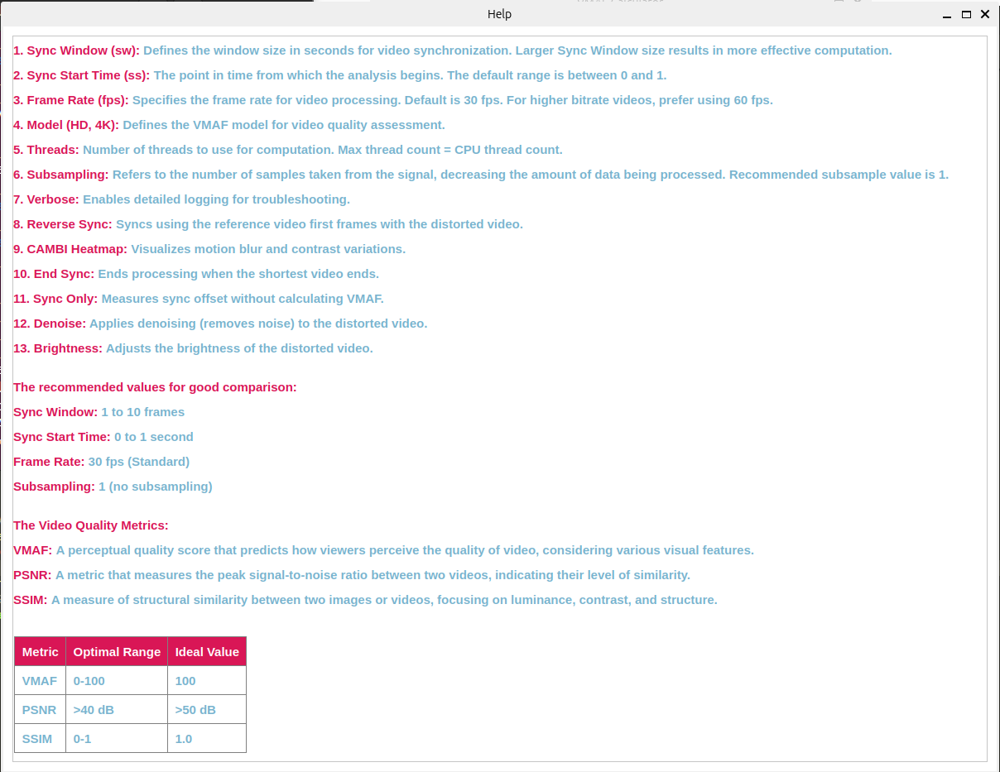

# TekMedia VMAF Calculator

A graphical user interface (GUI) tool for computing VMAF (Video Multi-Method Assessment Fusion) scores between a reference and distorted video. Built with PyQt5, this tool enables users to customize various settings, including frame rate, model selection, brightness adjustments, and more.

## Features

- User-friendly GUI: Easy to use interface built with PyQt5.
- Video Input: Select reference and distorted videos for comparison.
- Custom Parameters: Adjust sync window, frame rate, subsampling, and more.
- Model Selection: Choose from HD and 4K models.
- Additional Options: Supports brightness adjustment, denoising, CAMBI heatmap, and synchronization options.
- Real-time Output: Displays progress and results in real-time.
- Progress Bar: Shows computation progress when enabled.

## Requirements

- Python 3.0+
- FFmpeg >= 5.0 installed (for video processing) build with **libvmaf**
- PyQt5

## Installation

1. Clone the repository:
```
git clone https://github.com/TekMedia-Software/VMAF-Calculator.git
```
```
cd VMAF-Calculator
```

2. Install required Python version Python 3 or above:
```
sudo apt update
```
```
sudo apt install python3
```
```
sudo apt-get install python3-pip
```

3. Ensure FFmpeg >= 5.0 is installed:
  - Download from FFmpeg's official website build with libvmaf.
  - Add FFmpeg to your system PATH.
    	
4. Install dependencies: To install all necessary Python packages, run:
```
pip install -r requirements.txt
```

5. Run the application:
```
python3 app.py
```

## Usage

- Launch the application using the command above.
- Select your Distorted Video and Reference Video using the 'Browse' buttons.
- Customize parameters like Sync Window, Frame Rate, Model, and other optional settings.
- If you enable the Progress checkbox, a progress bar will display during computation.
- Click Compute VMAF to start the process. Output will be displayed in the text area.
- Once the calculation is complete, you can view the VMAF scores in the output display.

## Example

Here's an example of how to use the VMAF Calculator:

- Select a distorted video (e.g., distorted.mp4) and a reference video (e.g., reference.mp4).
- Set Frame Rate to 30 and choose the HD model.
- Enable Progress to view real-time progress.
- Click Compute VMAF to begin.
- The progress bar shows the computation status, and results appear in the output area.

## Tools and Technologies

- PyQt5: For creating the user interface.
- FFmpeg: For video decoding and processing.
- VMAF: The backend tool for video quality analysis.

## Screenshots

- **Main Menu**



- **Choosing Video Files and Selecting options**









- **Help**


    
## Contact

For any questions or feedback, please reach out:

- Awadh Bajpai - [awabaj@tekmediasoft.net](mailto:awabaj@tekmediasoft.net)
- Sushanthika Manikandan - [susman@tekmediasoft.net](mailto:susman@tekmediasoft.net)

## Acknowledgements

- Inspiration: This project was inspired by [Eyevinn’s EasyVmaf](https://github.com/Eyevinn/easyVmaf) project, which provided valuable insights into video quality analysis and metrics evaluation.
- Contributors: Thank you to the open-source community and contributors of relevant libraries and tools that enabled this project.
    
## Contributing

We welcome contributions! Please see the [CONTRIBUTING.md](CONTRIBUTING.md) file for detailed guidelines on how to contribute to this project.

## License

This project is licensed under a proprietary license. All rights reserved. You may modify and use this software for personal purposes, but for any production use, reproduction, modification, or distribution, prior written permission from [**TekMedia Software Services**](https://tekmediasoft.com) is required.

